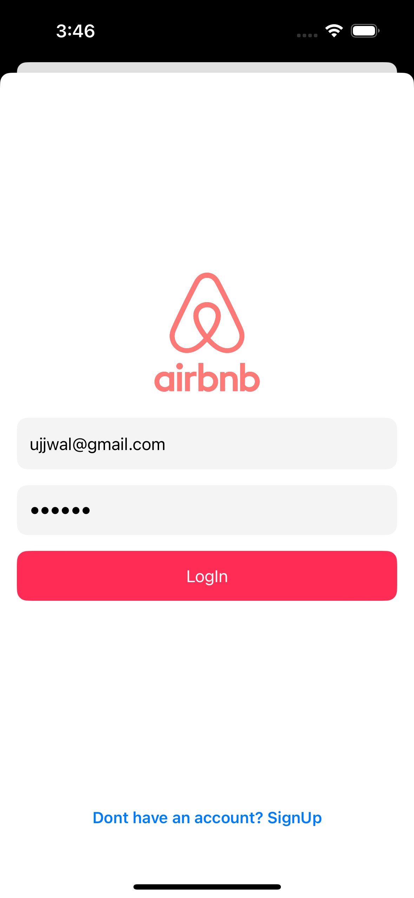
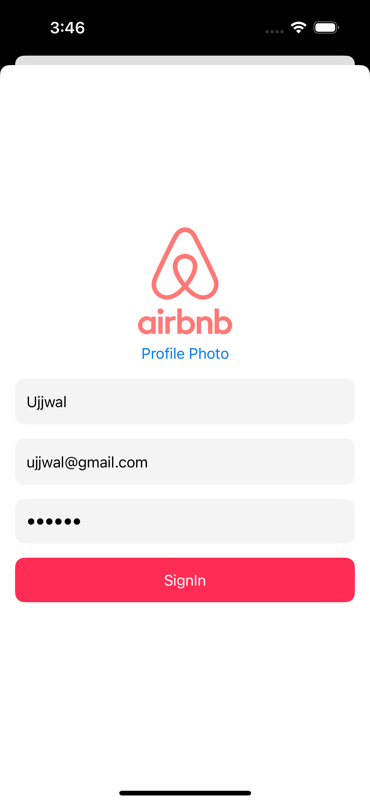
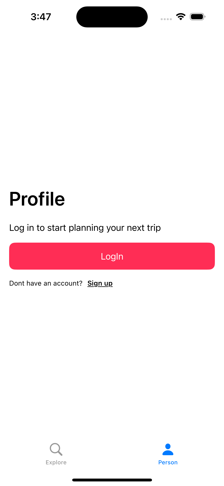
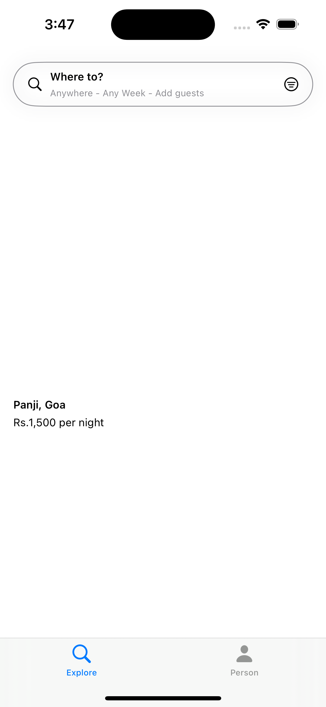
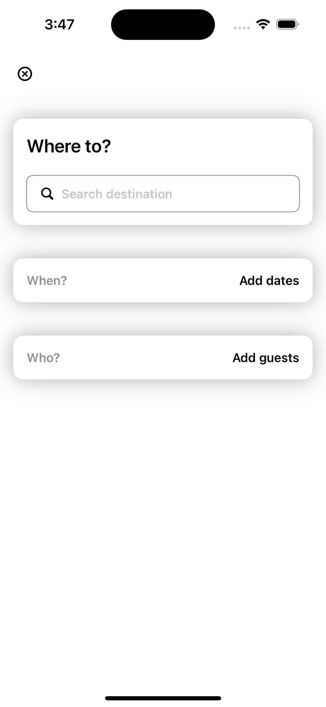
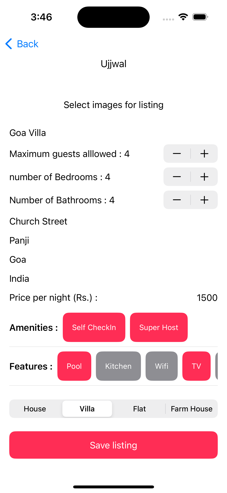

# Airbnb Clone

This project is a **SwiftUI-based Airbnb clone** application that includes Firebase authentication, Firestore integration, user profile uploads, listing uploads, and filtering capabilities. The app follows the MVVM architecture. Users can sign up, log in, log out, update their profile photo, upload new listings with images and details, and view/filter listing properties.

## Features

- **User Authentication** (Sign-up, Login, Logout) using Firebase.
- Firestore integration for storing and retrieving **user and listing data**.
- Upload user **profile photos** to Firebase Storage.
- Upload property **listings** with images, descriptions, and locations to Firestore.
- **Filter listings** based on location.
- MVVM architecture for clear separation of concerns.
- Asynchronous network requests using `async/await`.

## Technologies Used

- **SwiftUI** for building the user interface.
- **Firebase Authentication** for managing user accounts.
- **Firebase Firestore** for cloud database storage (users and listings).
- **Firebase Storage** for uploading profile photos and listing images.
- **MVVM architecture** pattern.
- Swift concurrency with **async/await** for network requests.

## Screenshots

### Log In Screen

### Sign In Screen

### Profile Screen

### Explore Listings

### Filter Listings

### Add Listings

